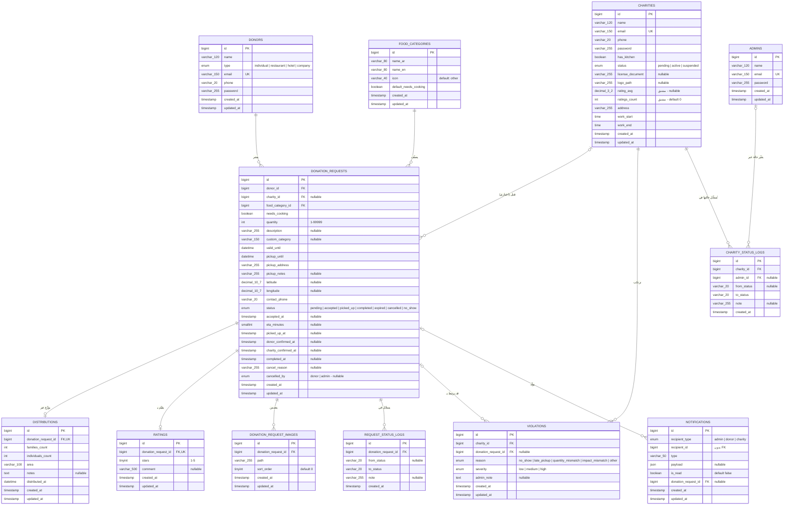

# مخطط قاعدة البيانات (ERD) — منصة نعمتي

> ملف شامل يشرح كل كيانات قاعدة بيانات المنصة، وكل خاصية (Attribute) فيها، وكل علاقة (Relationship) بينها مع نوعها وقواعد حذفها.
> المصدر: ملفات الـ Migrations والـ Models في `backend/database/migrations` و `backend/app/Models`.

---

## فهرس

1. [نظرة عامة على النظام](#1-نظرة-عامة-على-النظام)
2. [المخطط الكامل (ERD)](#2-المخطط-الكامل-erd)
3. [شرح الكيانات والخصائص](#3-شرح-الكيانات-والخصائص)
4. [شرح العلاقات بالتفصيل](#4-شرح-العلاقات-بالتفصيل)
5. [الخصائص المشتقة (Derived Attributes)](#5-الخصائص-المشتقة-derived-attributes)
6. [دورة حياة طلب التبرع (Status Lifecycle)](#6-دورة-حياة-طلب-التبرع-status-lifecycle)
7. [الجداول التقنية (خارج النطاق الوظيفي)](#7-الجداول-التقنية-خارج-النطاق-الوظيفي)
8. [ملاحظات تصميمية مهمة](#8-ملاحظات-تصميمية-مهمة)

---

## 1. نظرة عامة على النظام

**نعمتي** منصة تربط بين **المتبرعين بالطعام** (أفراد، مطاعم، فنادق، شركات) و**الجمعيات الخيرية** التي تستلم الطعام وتوزعه على العائلات المحتاجة، مع **إشراف إداري** يتابع الطلبات والجمعيات ويسجل المخالفات.

الكيانات الوظيفية الأساسية **11 كيان**:

| # | الكيان | الجدول في قاعدة البيانات | النموذج (Model) | الدور |
|---|-------|--------------------------|------------------|-------|
| 1 | المتبرع | `donors` | `Donor` | ينشر طلبات التبرع بالطعام |
| 2 | الجمعية الخيرية | `charities` | `Charity` | تقبل الطلبات وتستلم وتوزع |
| 3 | تصنيف الطعام | `food_categories` | `FoodCategory` | تصنيف ثابت للطعام (مطبوخ، معلبات…) |
| 4 | طلب التبرع | `donation_requests` | `DonationRequest` | **الجدول المحوري** — دورة حياة التبرع كاملة |
| 5 | صورة الطلب | `donation_request_images` | `DonationRequestImage` | صور الطعام المرفقة بالطلب |
| 6 | التوزيع | `distributions` | `Distribution` | تقرير الجمعية بعد توزيع الطعام |
| 7 | التقييم | `ratings` | `Rating` | تقييم المتبرع للجمعية (نجوم) |
| 8 | المخالفة | `violations` | `Violation` | مخالفة تسجل ضد جمعية (No-show…) |
| 9 | سجل حالات الطلب | `request_status_logs` | `RequestStatusLog` | تدقيق (Audit) لكل تغيير حالة |
| 10 | المدير | `admins` | `Admin` | مشرف المنصة (لوحة تحكم Filament) |
| 11 | سجل حالات الجمعية | `charity_status_logs` | `CharityStatusLog` | تدقيق لتغييرات حالة الجمعية |
| 12 | الإشعار | `notifications` | `Notification` | إشعارات الأطراف الثلاثة |

---

## 2. المخطط الكامل (ERD)

المخطط أدناه بتدوين **Crow's Foot**. الاصطلاحات:

| الرمز | المعنى |
|-------|--------|
| `||` | واحد بالضبط (One and only one) |
| `|o` | صفر أو واحد (Zero or one) — اختياري |
| `}o` / `o{` | صفر أو أكثر (Zero or many) |
| `PK` | مفتاح أساسي |
| `FK` | مفتاح أجنبي |
| `UK` | قيد فريد (Unique) |



> **ملاحظة:** أنواع البيانات في المخطط مكتوبة بدون أقواس لتوافق صيغة Mermaid — النوع الحقيقي مذكور في جداول الشرح أدناه (مثلاً `varchar_120` تعني `VARCHAR(120)`).

---

## 3. شرح الكيانات والخصائص

### 3.1 المتبرع — `donors`

الجهة التي تملك طعاماً فائضاً وتريد التبرع به. قد يكون فرداً أو منشأة تجارية. حسابه مستقل تماماً عن حساب الجمعية.

| الخاصية | النوع | القيود | الشرح |
|---------|------|--------|-------|
| `id` | BIGINT | PK, Auto-increment | معرّف المتبرع |
| `name` | VARCHAR(120) | NOT NULL | اسم المتبرع أو اسم المنشأة |
| `type` | ENUM | NOT NULL, DEFAULT `individual` | نوع المتبرع: `individual` (فرد)، `restaurant` (مطعم)، `hotel` (فندق)، `company` (شركة) |
| `email` | VARCHAR(150) | NOT NULL, **UNIQUE** | البريد الإلكتروني — يستخدم لتسجيل الدخول |
| `phone` | VARCHAR(20) | NOT NULL | رقم الهاتف للتواصل |
| `password` | VARCHAR(255) | NOT NULL | كلمة المرور (مشفّرة/Hashed) |
| `created_at` / `updated_at` | TIMESTAMP | NULLable | طوابع زمنية تلقائية من Laravel |

---

### 3.2 الجمعية الخيرية — `charities`

الجهة التي تستلم التبرع وتوزعه. تمر بحالة اعتماد إدارية قبل أن تعمل، ويحتفظ النظام بمعدل تقييمها.

| الخاصية | النوع | القيود | الشرح |
|---------|------|--------|-------|
| `id` | BIGINT | PK | معرّف الجمعية |
| `name` | VARCHAR(120) | NOT NULL | اسم الجمعية |
| `email` | VARCHAR(150) | NOT NULL, **UNIQUE** | بريد تسجيل الدخول |
| `phone` | VARCHAR(20) | NOT NULL | هاتف التواصل |
| `password` | VARCHAR(255) | NOT NULL | كلمة المرور (مشفّرة) |
| `has_kitchen` | BOOLEAN | NOT NULL, DEFAULT `false` | هل تملك مطبخاً؟ — يهم لأن بعض التبرعات تحتاج طبخاً أو تسخيناً |
| `status` | ENUM | NOT NULL, DEFAULT `pending` | حالة الاعتماد: `pending` (بانتظار الموافقة)، `active` (نشطة)، `suspended` (موقوفة) |
| `license_document` | VARCHAR(255) | NULL | مسار ملف رخصة الجمعية (تُرفع عند التسجيل للتحقق الإداري) |
| `logo_path` | VARCHAR(255) | NULL | مسار شعار الجمعية — يظهر للمتبرع عند قبول طلبه |
| `rating_avg` | DECIMAL(3,2) | NULL | **خاصية مشتقة**: متوسط النجوم من كل تقييمات الجمعية (تُحدَّث آلياً بواسطة `RatingObserver`) |
| `ratings_count` | INT UNSIGNED | NOT NULL, DEFAULT 0 | **خاصية مشتقة**: عدد التقييمات المستخدمة في المتوسط |
| `address` | VARCHAR(255) | NOT NULL | عنوان الجمعية |
| `work_start` | TIME | NOT NULL | بداية ساعات العمل |
| `work_end` | TIME | NOT NULL | نهاية ساعات العمل |
| `created_at` / `updated_at` | TIMESTAMP | NULL | طوابع زمنية |

---

### 3.3 تصنيف الطعام — `food_categories`

جدول مرجعي (Lookup Table) ثابت تديره المنصة، وليس المحتوى: وجبات عائلية، معلبات، خضار…

| الخاصية | النوع | القيود | الشرح |
|---------|------|--------|-------|
| `id` | BIGINT | PK | معرّف التصنيف |
| `name_ar` | VARCHAR(80) | NOT NULL | اسم التصنيف بالعربية |
| `name_en` | VARCHAR(80) | NOT NULL | اسم التصنيف بالإنجليزية |
| `icon` | VARCHAR(40) | NOT NULL, DEFAULT `other` | مفتاح أيقونة يعيّنه التطبيق (مثل `family_meals`) — ليس رابط URL |
| `default_needs_cooking` | BOOLEAN | NOT NULL, DEFAULT `false` | هل هذا التصنيف يحتاج طبخاً افتراضياً؟ (يستخدم كقيمة مبدئية للطلب) |
| `created_at` / `updated_at` | TIMESTAMP | NULL | طوابع زمنية |

---

### 3.4 طلب التبرع — `donation_requests` ⭐ (الجدول المحوري)

قلب النظام: كل تبرع هو "طلب" يمر بدورة حياة كاملة من النشر حتى الإغلاق، ويحمل كل الطوابع الزمنية والأحداث التي مرّ بها.

**المفاتيح والروابط:**

| الخاصية | النوع | القيود | الشرح |
|---------|------|--------|-------|
| `id` | BIGINT | PK | معرّف الطلب |
| `donor_id` | BIGINT | NOT NULL, **FK → donors** (CASCADE DELETE) | المتبرع صاحب الطلب — إجباري |
| `charity_id` | BIGINT | NULL, **FK → charities** (SET NULL على الحذف) | الجمعية التي قبلت الطلب — يبدأ فارغاً (NULL) حتى تقبل جمعية ما |
| `food_category_id` | BIGINT | NOT NULL, **FK → food_categories** (RESTRICT DELETE) | تصنيف الطعام — لا يمكن حذف تصنيف مستخدم في أي طلب |

**بيانات الطعام:**

| الخاصية | النوع | القيود | الشرح |
|---------|------|--------|-------|
| `needs_cooking` | BOOLEAN | NOT NULL, DEFAULT `false` | هل الطعام يحتاج طبخاً/تسخيناً؟ (يعتمد على قدرة الجمعية `has_kitchen`) |
| `quantity` | INT UNSIGNED | NOT NULL, DEFAULT 1 | الكمية التقديرية بعدد الأشخاص (1–99999) — تقدير المتبرع فقط؛ الأرقام الحقيقية تأتي لاحقاً في `distributions` |
| `description` | VARCHAR(255) | NULL | وصف حر للطعام نفسه |
| `custom_category` | VARCHAR(150) | NULL | إذا اختار المتبرع تصنيف "غير ذلك" يكتب هنا اسم التصنيف الفعلي |

**الموقع والاستلام:**

| الخاصية | النوع | القيود | الشرح |
|---------|------|--------|-------|
| `valid_until` | DATETIME | NOT NULL | آخر لحظة يبقى فيها الطعام صالحاً للأكل |
| `pickup_until` | DATETIME | NOT NULL | آخر لحظة ممكنة لاستلام الطعام من المتبرع |
| `pickup_address` | VARCHAR(255) | NOT NULL | العنوان النصي لمكان الاستلام |
| `pickup_notes` | VARCHAR(255) | NULL | ملاحظات الوصول للمتبرع: "اتصل قبل ربع ساعة"، "الباب الجانبي خلف الجامع" |
| `latitude` | DECIMAL(10,7) | NULL | خط العرض (اختياري — دبوس الخريطة) |
| `longitude` | DECIMAL(10,7) | NULL | خط الطول (اختياري — دبوس الخريطة) |
| `contact_phone` | VARCHAR(20) | NOT NULL | هاتف التواصل الخاص بهذا الطلب |

**الحالة والأحداث الزمنية:**

| الخاصية | النوع | القيود | الشرح |
|---------|------|--------|-------|
| `status` | ENUM | NOT NULL, DEFAULT `pending` | الحالة الحالية: `pending` → `accepted` → `picked_up` → `completed`، أو `expired` / `cancelled` / `no_show` (انظر القسم 6) |
| `accepted_at` | TIMESTAMP | NULL | متى قبلت الجمعية الطلب |
| `eta_minutes` | SMALLINT UNSIGNED | NULL | مدة الوصول بالدقائق التي حددتها الجمعية عند القبول |
| `picked_up_at` | TIMESTAMP | NULL | متى تم استلام الطعام فعلياً |
| `donor_confirmed_at` | TIMESTAMP | NULL | تأكيد **المتبرع** لعملية التسليم (وجه أول من وجهي التسليم) |
| `charity_confirmed_at` | TIMESTAMP | NULL | تأكيد **الجمعية** لعملية التسليم (الوجه الثاني) — لا يصل الطلب إلى `picked_up` إلا إذا عُبِّئ الاثنان معاً |
| `completed_at` | TIMESTAMP | NULL | متى سجلت الجمعية أرقام التوزيع — اللحظة التي يكتمل فيها الطلب فعلاً |
| `cancel_reason` | VARCHAR(255) | NULL | سبب الإلغاء (إن أُلغي) |
| `cancelled_by` | ENUM | NULL | مَن ألغى: `donor` (إلغاء طوعي) أو `admin` (حذف طلب وهمي/مخالف) — NULL لكل الحالات الأخرى |
| `created_at` / `updated_at` | TIMESTAMP | NULL | طوابع زمنية |

**الفهارس (Indexes):** فهرس على `status`، وفهرس مركّب على (`status`, `valid_until`) — لأن أشيع استعلام هو "الطلبات المنشورة التي لم تنته صلاحيتها".

---

### 3.5 صورة الطلب — `donation_request_images`

صور يرفعها المتبرع للطعام حتى تراها الجمعية قبل أن تتحرك للاستلام.

| الخاصية | النوع | القيود | الشرح |
|---------|------|--------|-------|
| `id` | BIGINT | PK | المعرّف |
| `donation_request_id` | BIGINT | NOT NULL, FK → donation_requests (CASCADE) | الطلب الذي تنتمي له الصورة |
| `path` | VARCHAR(255) | NOT NULL | مسار الملف على قرص التخزين (العميل يحصل على URL وليس المسار) |
| `sort_order` | TINYINT UNSIGNED | NOT NULL, DEFAULT 0 | ترتيب ظهور الصورة داخل الطلب |
| `created_at` / `updated_at` | TIMESTAMP | NULL | طوابع زمنية |

---

### 3.6 التوزيع — `distributions`

تقرير تُقدمه الجمعية بعد توزيع الطعام: كم عائلة استفادت وأين ومتى. **طلب واحد له توزيع واحد على الأكثر** (علاقة 1:1).

| الخاصية | النوع | القيود | الشرح |
|---------|------|--------|-------|
| `id` | BIGINT | PK | المعرّف |
| `donation_request_id` | BIGINT | NOT NULL, **UNIQUE**, FK → donation_requests (CASCADE) | الطلب المرتبط — قيد UNIQUE يضمن 1:1 |
| `families_count` | INT UNSIGNED | NOT NULL | عدد العائلات التي وزّع عليها |
| `individuals_count` | INT UNSIGNED | NOT NULL | عدد الأفراد المستفيدين |
| `area` | VARCHAR(100) | NOT NULL | المنطقة التي تم فيها التوزيع |
| `notes` | TEXT | NULL | ملاحظة حرة من الجمعية: "وُزّع أمام الجامع بعد صلاة الجمعة"، "صندوقان كانا فاسدين" |
| `distributed_at` | DATETIME | NOT NULL | تاريخ ووقت التوزيع الفعلي |
| `created_at` / `updated_at` | TIMESTAMP | NULL | طوابع زمنية |

---

### 3.7 التقييم — `ratings`

تقييم المتبرع للجمعية بعد اكتمال الطلب. **طلب واحد له تقييم واحد على الأكثر** (علاقة 1:1).

| الخاصية | النوع | القيود | الشرح |
|---------|------|--------|-------|
| `id` | BIGINT | PK | المعرّف |
| `donation_request_id` | BIGINT | NOT NULL, **UNIQUE**, FK → donation_requests (CASCADE) | الطلب المقيَّم — UNIQUE يضمن 1:1 |
| `stars` | TINYINT UNSIGNED | NOT NULL | عدد النجوم (1 إلى 5) |
| `comment` | VARCHAR(500) | NULL | تعليق نصي اختياري |
| `created_at` / `updated_at` | TIMESTAMP | NULL | طوابع زمنية |

---

### 3.8 المخالفة — `violations`

إنذار يسجّله المدير ضد جمعية (شاشة "سجل المخالفات"). الجدول كان اسمه `strikes` ثم أعيدت تسميته ليطابق الشاشة ويستوعب أكثر من نوع واحد.

| الخاصية | النوع | القيود | الشرح |
|---------|------|--------|-------|
| `id` | BIGINT | PK | المعرّف |
| `charity_id` | BIGINT | NOT NULL, FK → charities (CASCADE) | الجمعية المخالِفة |
| `donation_request_id` | BIGINT | NULL, FK → donation_requests (SET NULL) | الطلب الذي وقعت فيه المخالفة — اختياري لأن بعض المخالفات عامة |
| `reason` | ENUM | NOT NULL, DEFAULT `no_show` | السبب: `no_show` (لم تحضر)، `late_pickup` (تأخرت بالاستلام)، `quantity_mismatch` (كمية مختلفة عن المعلن)، `impact_mismatch` (أرقام توزيع غير متطابقة)، `other` |
| `severity` | ENUM | NOT NULL, DEFAULT `medium` | الخطورة: `low` / `medium` / `high` — لأن المخالفة الأولى ليست كالخامسة |
| `admin_note` | TEXT | NULL | شرح المدير، يُعرض للجمعية كما هو |
| `created_at` / `updated_at` | TIMESTAMP | NULL | طوابع زمنية |

---

### 3.9 سجل حالات الطلب — `request_status_logs`

جدول تدقيق (Audit Log): كل تغيير لحالة أي طلب يترك هنا صفاً يوثّق الانتقال. لا يُعدَّل ولا يُحذف — يُقرأ فقط.

| الخاصية | النوع | القيود | الشرح |
|---------|------|--------|-------|
| `id` | BIGINT | PK | المعرّف |
| `donation_request_id` | BIGINT | NOT NULL, FK → donation_requests (CASCADE) | الطلب الذي تغيرت حالته |
| `from_status` | VARCHAR(20) | NULL | الحالة السابقة (NULL لأول تسجيل) |
| `to_status` | VARCHAR(20) | NOT NULL | الحالة الجديدة |
| `note` | VARCHAR(255) | NULL | ملاحظة اختيارية عن سبب التغيير |
| `created_at` | TIMESTAMP | NOT NULL, DEFAULT CURRENT_TIMESTAMP | لحظة التغيير — فقط هذا الحقل، لا `updated_at` لأن الصف لا يتغير أبداً |

---

### 3.10 المدير — `admins`

حسابات مشرفي المنصة الذين يدخلون لوحة التحكم (Filament). وجود الحساب نفسه هو الصلاحية — لا تسجيل عام، تُنشأ الحسابات من الخادم فقط.

| الخاصية | النوع | القيود | الشرح |
|---------|------|--------|-------|
| `id` | BIGINT | PK | المعرّف |
| `name` | VARCHAR(120) | NOT NULL | اسم المدير |
| `email` | VARCHAR(150) | NOT NULL, **UNIQUE** | بريد تسجيل الدخول |
| `password` | VARCHAR(255) | NOT NULL | كلمة المرور (مشفّرة) |
| `created_at` / `updated_at` | TIMESTAMP | NULL | طوابع زمنية |

---

### 3.11 سجل حالات الجمعية — `charity_status_logs`

جدول تدقيق موازٍ لسجل حالات الطلب: يوثّق كل تغيير لحالة جمعية (اعتماد، إيقاف، إعادة تنشيط) ومَن من المدراء فعله.

| الخاصية | النوع | القيود | الشرح |
|---------|------|--------|-------|
| `id` | BIGINT | PK | المعرّف |
| `charity_id` | BIGINT | NOT NULL, FK → charities (CASCADE) | الجمعية التي تغيرت حالتها |
| `admin_id` | BIGINT | NULL, FK → admins (SET NULL) | المدير الذي أجرى التغيير — يبقى الصف حتى لو حُذف حسابه |
| `from_status` | VARCHAR(20) | NULL | الحالة السابقة |
| `to_status` | VARCHAR(20) | NOT NULL | الحالة الجديدة |
| `note` | VARCHAR(255) | NULL | ملاحظة التغيير |
| `created_at` | TIMESTAMP | NOT NULL, DEFAULT CURRENT_TIMESTAMP | لحظة التغيير |

**الفهرس:** (`charity_id`, `created_at`) — لقراءة تاريخ جمعية بترتيب زمني.

---

### 3.12 الإشعار — `notifications`

إشعارات داخل المنصة توجه لأي من الأطراف الثلاثة (مدير / متبرع / جمعية) حول الأحداث.

| الخاصية | النوع | القيود | الشرح |
|---------|------|--------|-------|
| `id` | BIGINT | PK | المعرّف |
| `recipient_type` | ENUM | NOT NULL | نوع المستلم: `admin` / `donor` / `charity` |
| `recipient_id` | BIGINT | NULL | معرّف المستلم — **بدون قيد FK** (علاقة شبه متعددة الأشكال، انظر القسم 8). يكون NULL عندما يكون المستلم "المدير" بشكل عام |
| `type` | VARCHAR(50) | NOT NULL | نوع الإشعار: `request_accepted` / `handover_confirmed` / `request_cancelled` |
| `payload` | JSON | NULL | بيانات إضافية مرنة حسب نوع الإشعار |
| `is_read` | BOOLEAN | NOT NULL, DEFAULT `false` | هل قُرئ الإشعار |
| `donation_request_id` | BIGINT | NULL, FK → donation_requests (SET NULL) | الطلب الذي يتعلق به الإشعار إن وجد |
| `created_at` / `updated_at` | TIMESTAMP | NULL | طوابع زمنية |

**الفهرس المركّب:** (`recipient_type`, `recipient_id`, `is_read`) — لأشيع استعلام: "الإشعارات غير المقروءة لمستلم معين".

---

## 4. شرح العلاقات بالتفصيل

### ر1. المتبرع — طلبات التبرع (1 : N إجبارية)

```
donors ||--o{ donation_requests : donor_id
```

- **المعنى:** المتبرع الواحد ينشر صفر أو أكثر من طلبات التبرع، وكل طلب ينتمي لمتبرع واحد بالضبط (لا يوجد طلب بلا متبرع).
- **المفتاح الأجنبي:** `donation_requests.donor_id` → `donors.id` (NOT NULL).
- **قاعدة الحذف (CASCADE):** حذف المتبرع يحذف معه كل طلباته تلقائياً — الطلب بلا متبرع لا معنى له.

### ر2. الجمعية — طلبات التبرع (0..1 : N اختيارية)

```
charities |o--o{ donation_requests : charity_id
```

- **المعنى:** الجمعية الواحدة قد تقبل صفر أو أكثر من الطلبات، والطلب الواحد يقبل به **صفر أو واحدة** من الجمعيات.
- **لماذا اختيارية؟** الطلب يُنشر أولاً (`pending`) بدون جمعية؛ عند قبول جمعية له يُخزّن معرّفها ويُعبّأ `accepted_at`.
- **المفتاح الأجنبي:** `donation_requests.charity_id` → `charities.id` (NULL مسموح).
- **قاعدة الحذف (SET NULL):** حذف الجمعية لا يحذف الطلبات — يكتفي بفك ارتباطها (تصبح `charity_id = NULL`) حفاظاً على السجل التاريخي للتبرعات.

### ر3. تصنيف الطعام — طلبات التبرع (1 : N مع منع الحذف)

```
food_categories ||--o{ donation_requests : food_category_id
```

- **المعنى:** التصنيف الواحد يُستخدم في صفر أو أكثر من الطلبات، وكل طلب مصنّف بتصنيف واحد بالضبط.
- **المفتاح الأجنبي:** `donation_requests.food_category_id` → `food_categories.id` (NOT NULL).
- **قاعدة الحذف (RESTRICT):** لا يمكن حذف تصنيف ما دام مستخدماً في أي طلب — حماية لسلامة البيانات المرجعية (جدول مرجعي ثابت).

### ر4. طلب التبرع — التوزيع (1 : 1 اختيارية من جهة الطلب)

```
donation_requests ||--o| distributions : donation_request_id
```

- **المعنى:** كل طلب له **تقرير توزيع واحد على الأكثر**، وكل تقرير توزيع يعود لطلب واحد بالضبط.
- **كيف تتحقق 1:1؟** المفتاح الأجنبي `distributions.donation_request_id` يحمل قيد **UNIQUE** إضافةً إلى كونه FK — فيستحيل وجود تقريرين لنفس الطلب.
- **قاعدة الحذف (CASCADE):** حذف الطلب يحذف تقرير توزيعه.
- **دلالة عملية:** وجود صف توزيع يعني أن الجمعية نفذت التوزيع وأبلغت عن الأرقام (وهي لحظة `completed_at`).

### ر5. طلب التبرع — التقييم (1 : 1 اختيارية من جهة الطلب)

```
donation_requests ||--o| ratings : donation_request_id
```

- **المعنى:** كل طلب يقيَّم مرة واحدة على الأكثر من متبرعه، وكل تقييم يعود لطلب واحد بالضبط.
- **كيف تتحقق 1:1؟** قيد **UNIQUE** على `ratings.donation_request_id`.
- **قاعدة الحذف (CASCADE):** حذف الطلب يحذف تقييمه.
- **أثر جانبي مهم:** كتابة تقييم تُحدّث (عبر `RatingObserver`) الخصائص المشتقة `rating_avg` و `ratings_count` في جدول الجمعية صاحبة الطلب.

### ر6. طلب التبرع — صور الطلب (1 : N)

```
donation_requests ||--o{ donation_request_images : donation_request_id
```

- **المعنى:** الطلب يتضمن صفراً أو أكثر من الصور، وكل صورة تنتمي لطلب واحد بالضبط.
- **قاعدة الحذف (CASCADE):** حذف الطلب يحذف كل صوره.
- **فهرس مركّب:** (`donation_request_id`, `sort_order`) لجلب الصور مرتبة مباشرة.

### ر7. طلب التبرع — سجل حالات الطلب (1 : N)

```
donation_requests ||--o{ request_status_logs : donation_request_id
```

- **المعنى:** كل تغيير حالة للطلب يُضاف له صف جديد في السجل؛ الطلب الواحد يملك صفراً أو أكثر من سجلات الحالة، وكل سجل يعود لطلب واحد بالضبط.
- **قاعدة الحذف (CASCADE):** حذف الطلب يمحو مساره التدقيقي معه.
- **الدور:** قراءة فقط (Append-only) — يبنى منه شريط "تاريخ الطلب" في التطبيق والتدقيق الإداري.

### ر8. الجمعية — المخالفات (1 : N إجبارية)

```
charities ||--o{ violations : charity_id
```

- **المعنى:** الجمعية تُسجَّل ضدّها صفر أو أكثر من المخالفات، وكل مخالفة تعود لجمعية واحدة بالضبط.
- **المفتاح الأجنبي:** `violations.charity_id` → `charities.id` (NOT NULL).
- **قاعدة الحذف (CASCADE):** حذف الجمعية يحذف مخالفاتها.

### ر9. طلب التبرع — المخالفات (0..1 : N اختيارية)

```
donation_requests |o--o{ violations : donation_request_id
```

- **المعنى:** المخالفة قد تكون مرتبطة بطلب معين (مثل `no_show` على طلب محدد) أو تكون عامة بدون طلب؛ والطلب الواحد قد يرتبط به صفر أو أكثر من المخالفات.
- **المفتاح الأجنبي:** `violations.donation_request_id` → `donation_requests.id` (NULL مسموح).
- **قاعدة الحذف (SET NULL):** حذف الطلب يبقي المخالفة قائمة لكن يفك ارتباطها بالطلب.

### ر10. الجمعية — سجل حالات الجمعية (1 : N)

```
charities ||--o{ charity_status_logs : charity_id
```

- **المعنى:** كل تغيير لحالة الجمعية (pending → active → suspended…) يسجَّل بصف مستقل؛ الجمعية الواحدة لها صفر أو أكثر من سجلات الحالة.
- **قاعدة الحذف (CASCADE):** حذف الجمعية يحذف سجل حالتها.

### ر11. المدير — سجل حالات الجمعية (0..1 : N اختيارية)

```
admins |o--o{ charity_status_logs : admin_id
```

- **المعنى:** كل تغيير حالة يقوم به مدير (صفر أو أكثر من السجلات لكل مدير)، وكل سجل يقوم به مدير واحد — أو بدون مدير.
- **قاعدة الحذف (SET NULL — قرار مقصود):** حذف حساب المدير **لا يحذف** سجل التدقيق؛ صف تدقيق يفقد فاعله أفضل من صف يختفي تماماً.
- **اللافت:** الجمعيات لا تُعتمد تلقائياً — كل انتقال حالة يمر بمدير ويُوثَّق باسمه.

### ر12. طلب التبرع — الإشعارات (0..1 : N اختيارية)

```
donation_requests |o--o{ notifications : donation_request_id
```

- **المعنى:** الحدث على الطلب (قبول، تأكيد تسليم، إلغاء) يولّد صفراً أو أكثر من الإشعارات، والإشعار الواحد قد يرتبط بطلب أو يكون عاماً.
- **قاعدة الحذف (SET NULL):** حذف الطلب يبقي الإشعار لكن يفك ارتباطه.

### ر13. الإشعار — المستلم (علاقة شبه متعددة الأشكال بلا FK)

```
notifications.recipient_type + notifications.recipient_id  ⟶  donors | charities | admins
```

- **المعنى:** الإشعار يوجَّه لمستلم يكون مديراً أو متبرعاً أو جمعية، حسب قيمة `recipient_type`، ومعرّفه في `recipient_id`.
- **قرار تصميمي — لا قيد FK:** المستلمون موزعون على ثلاثة جداول مختلفة، فلا يمكن لمفتاح أجنبي واحد أن يشير إلى الثلاثة. لذلك الربط منطقي (من طرف التطبيق) وليس قيداً في قاعدة البيانات، مع فهرس مركّب لتسريع الجلب.
- **حالة خاصة:** عندما يكون `recipient_type = admin` قد يكون `recipient_id = NULL` — أي إشعار موجّه "للإدارة" ككل وليس لمدير بعينه.

---

## 5. الخصائص المشتقة (Derived Attributes)

هناك خاصيتان في جدول `charities` لا تُدخل يدوياً أبداً — بل تُحسبان من جدول `ratings`:

| الخاصية | تُحسب كيف؟ | لماذا خُزنت بدل حسابها كل مرة؟ |
|---------|-------------|-------------------------------|
| `rating_avg` | متوسط `stars` لكل التقييمات المرتبطة بطلبات الجمعية | تظهر على شاشة يفتشها المتبرع باستمرار (بطاقة الجمعية بعد القبول)؛ حسابها في كل قراءة مكلف، وهي لا تتغير إلا عند كتابة تقييم جديد |
| `ratings_count` | عدد صفوف `ratings` لتلك الجمعية | لنفس السبب — تُعرض بجانب المتوسط ("4.6 من 23 تقييم") |

المزامنة مسؤولية `RatingObserver`: عند إنشاء تقييم أو حذفه يعيد حساب العمودين في صف الجمعية المعنية. لهذا السبب أيضاً هما **غير مدرجتين** في `$fillable` لنموذج `Charity` حتى لا يكتبهما أحد يدوياً.

---

## 6. دورة حياة طلب التبرع (Status Lifecycle)

قيم `status` الممكنة والانتقالات بينها:

```
pending ──(جمعية تقبل)──▶ accepted ──(الطرفان يؤكدان التسليم)──▶ picked_up ──(الجمعية تسجل التوزيع)──▶ completed
   │                          │
   │                          ├──(الجمعية لا تحضر)──▶ no_show
   ├──(انتهت valid_until أو pickup_until)──▶ expired
   │
   └──(المتبرع يلغي أو المدير يحذف طلباً وهمياً)──▶ cancelled
```

| الحالة | المعنى | الحقول المرافقة |
|--------|--------|------------------|
| `pending` | منشور وينتظر قبول جمعية | — |
| `accepted` | جمعية قبلت وطريقها للاستلام | `charity_id`, `accepted_at`, `eta_minutes` |
| `picked_up` | تم تسليم الطعام **بتأكيد الطرفين معاً** | `picked_up_at`, `donor_confirmed_at` + `charity_confirmed_at` (كلاهما يجب أن يكون معبآً) |
| `completed` | الجمعية رفعت تقرير التوزيع — الطلب مكتمل فعلاً | `completed_at` + صف في `distributions` (+ غالباً صف في `ratings`) |
| `expired` | انتهت صلاحيته أو مهلة الاستلام دون إكمال | — |
| `cancelled` | أُلغي | `cancel_reason` + `cancelled_by` (donor/admin) |
| `no_show` | الجمعية لم تحضر بعد القبول | غالباً يرافقه صف `violations` بسبب `no_show` |

كل انتقال من هذه الحالات يترك أثراً في `request_status_logs` (ر7).

---

## 7. الجداول التقنية (خارج النطاق الوظيفي)

هذه جداول ينشئها Laravel/Sanctum تلقائياً وليست جزءاً من نموذج العمل، لكنها موجودة في قاعدة البيانات:

| الجدول | مصدره | الدور |
|--------|-------|-------|
| `personal_access_tokens` | Laravel Sanctum | توكنات API لكل من `donors` و`charities` و`admins` — الربط شبه متعدد الأشكال: `tokenable_type` + `tokenable_id` |
| `users` | Laravel scaffolding | جدول المستخدمين الافتراضي — **غير مستخدم فعلياً**؛ تسجيل دخول لوحة التحكم يستخدم الحارس `admin` وجدول `admins`، والتطبيق يستخدم `donors`/`charities` |
| `password_reset_tokens` | Laravel scaffolding | توكنات استعادة كلمة المرور |
| `sessions` | Laravel scaffolding | جلسات المستخدمين |
| `cache` / `cache_locks` | Laravel | التخزين المؤقت |
| `jobs` / `job_batches` / `failed_jobs` | Laravel | طوابير المهام المؤجلة |

عند رسم ERD للنظام الوظيفي (لتقرير أو عرض) يمكن استبعاد هذه الجداول — أو إدراج `personal_access_tokens` فقط إن أردت توثيق تسجيل الدخول.

---

## 8. ملاحظات تصميمية مهمة

1. **التسليم الثنائي (Two-sided handover):** الطلب لا يصل `picked_up` إلا إذا عبّأ كلٌّ من المتبرع والجمعية تأكيده الخاص (`donor_confirmed_at` و `charity_confirmed_at`). لا يستطيع طرف أن يدّعي استلاماً لم يحدث دون موافقة الطرف الآخر. (استُبدل هذا النظام بنظام رمز QR سابق حُذف.)

2. **سجلا تدقيق متطابقان في البنية:** `request_status_logs` (للطلبات) و `charity_status_logs` (للجمعيات) لهما نفس الأعمدة (`from_status`, `to_status`, `note`, `created_at`) عمداً — حتى تُقرأ مسارات التدقيق بنفس الطريقة في لوحة التحكم. كلاهما Append-only: صف واحد لكل حدث ولا تعديل بعده.

3. **تمييز الملغي:** `cancelled_by` يفرّق بين إلغاء المتبرع الطوعي وإلغاء المدير لطلب وهمي/مخالف — نفس الحالة النهائية لكن مصدران مختلفان تماماً في الدلالة.

4. **مخالفات بدل ضربات:** الجدول سمي أولاً `strikes` وكان يحمل سبباً واحداً (`no_show` فقط)، ثم أُعيدت تسميته `violations` ووُسّع `reason` لخمس قيم وأُضيف `severity` — لأن قرار إيقاف الجمعية يجب أن يوازن نوع المخالفة وعددها معاً.

5. **الكمية رقم لا وصف:** `quantity` عدد صحيح (عدد الأشخاص التقديري، 1–99999) بقيود تحقق على الواجهة والـ API. المتبرع **يقدّر** فقط؛ الأرقام الحقيقية تأتي لاحقاً من الجمعية في `distributions` (`families_count`, `individuals_count`). هذا الفصل بين التقدير والتقرير مقصود.

6. **الإحداثيات اختيارية:** `latitude`/`longitude` NULL لأن المتبرع دائماً يعطي عنواناً نصياً، والدبوس على الخريطة إضافة اختيارية — اشتراطهما كان سيمنع إنشاء الطلب بدون وصول للخريطة.

7. **حماية السجل التاريخي في الحذف:** لاحظ النمط المتعمد: `CASCADE` حيث التابع بلا معنى بلا الأصل (الصور، السجلات، التقييم، التوزيع)، و`SET NULL` حيث نريد إبقاء الأثر بعد غياب الأصل (طلبٌ بلا جمعية، مخالفة بلا طلب، تدقيقٌ بلا مدير، إشعار بلا طلب)، و`RESTRICT` للجداول المرجعية (التصنيفات).

---

## ملخص بطاقة العلاقات

| # | من | إلى | النوع | المفتاح | عند حذف الأب |
|---|-----|-----|-------|---------|---------------|
| 1 | donors | donation_requests | 1 : N (إجباري) | `donor_id` | CASCADE |
| 2 | charities | donation_requests | 0..1 : N | `charity_id` (NULL) | SET NULL |
| 3 | food_categories | donation_requests | 1 : N (إجباري) | `food_category_id` | RESTRICT |
| 4 | donation_requests | distributions | 1 : 1 | `donation_request_id` (UNIQUE) | CASCADE |
| 5 | donation_requests | ratings | 1 : 1 | `donation_request_id` (UNIQUE) | CASCADE |
| 6 | donation_requests | donation_request_images | 1 : N | `donation_request_id` | CASCADE |
| 7 | donation_requests | request_status_logs | 1 : N | `donation_request_id` | CASCADE |
| 8 | charities | violations | 1 : N (إجباري) | `charity_id` | CASCADE |
| 9 | donation_requests | violations | 0..1 : N | `donation_request_id` (NULL) | SET NULL |
| 10 | charities | charity_status_logs | 1 : N | `charity_id` | CASCADE |
| 11 | admins | charity_status_logs | 0..1 : N | `admin_id` (NULL) | SET NULL |
| 12 | donation_requests | notifications | 0..1 : N | `donation_request_id` (NULL) | SET NULL |
| 13 | donors/charities/admins | notifications | شبه متعدد الأشكال | `recipient_type` + `recipient_id` | بدون قيد FK |
